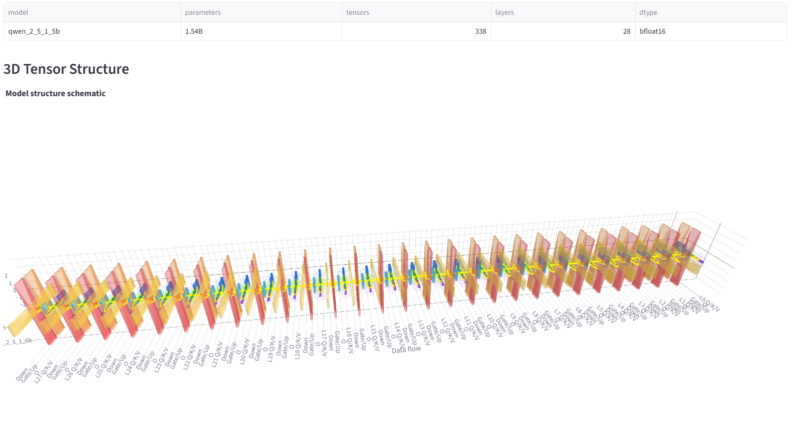
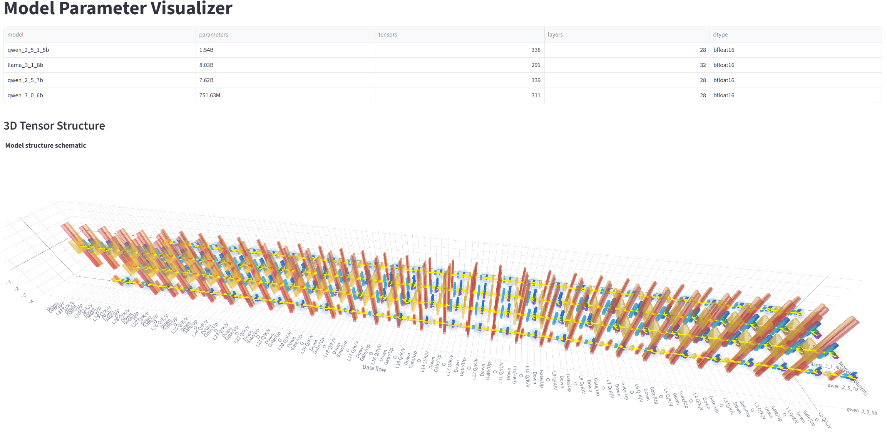
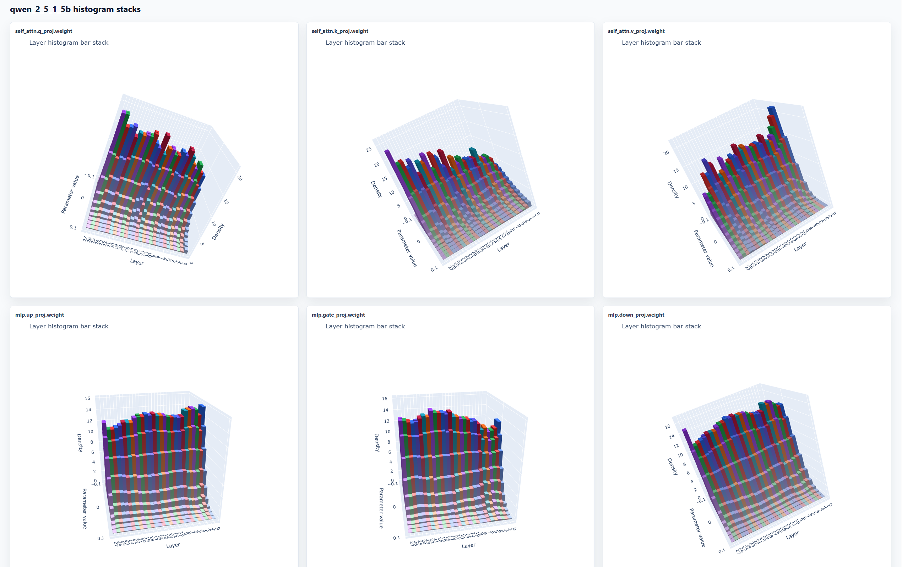
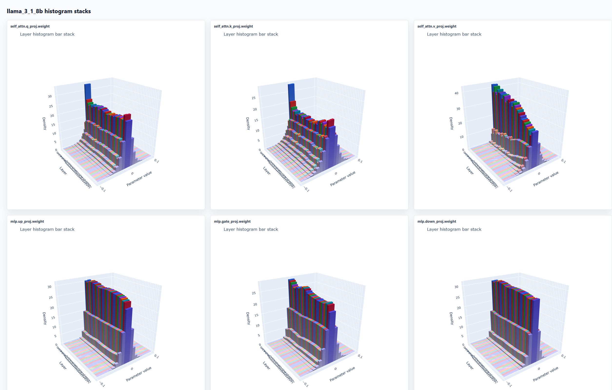
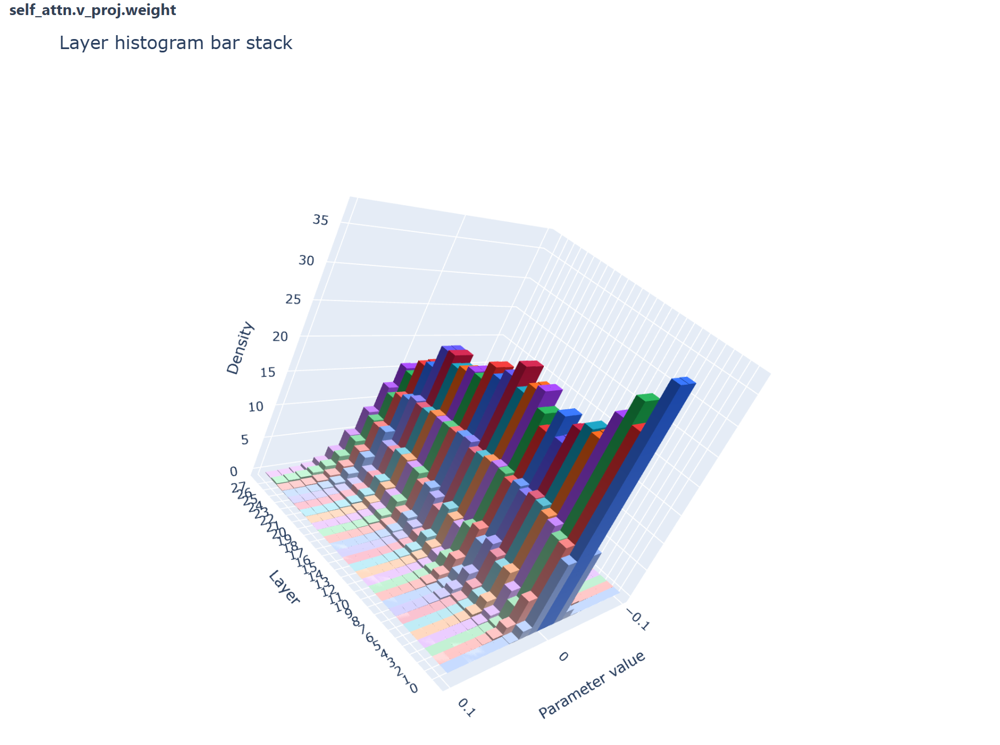
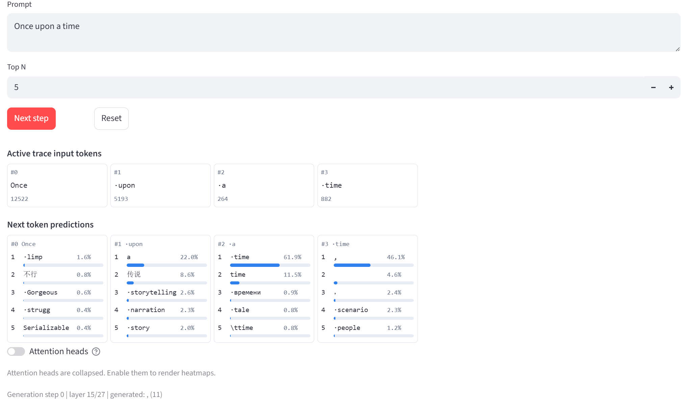
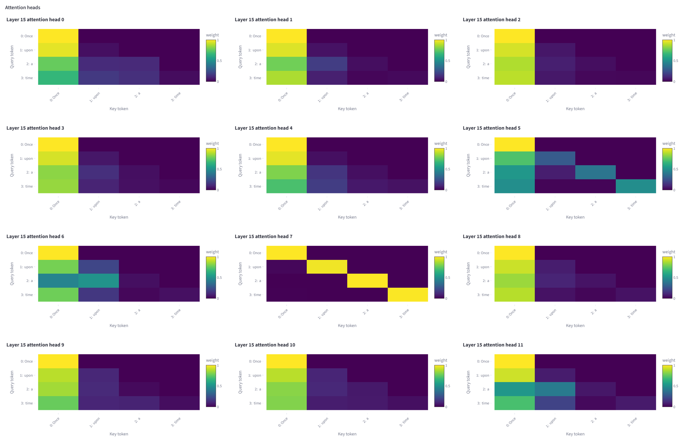
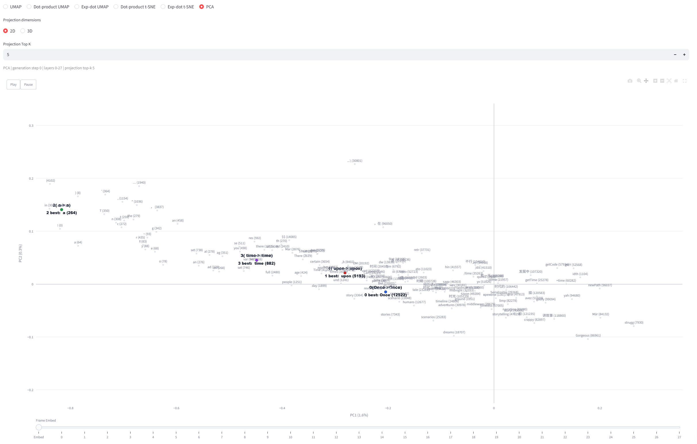
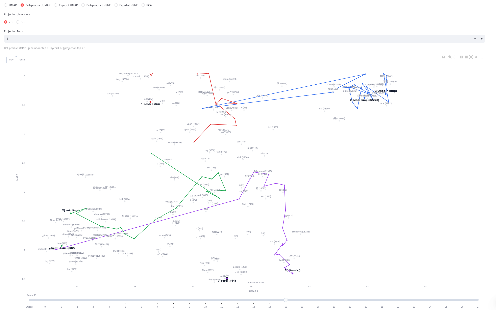
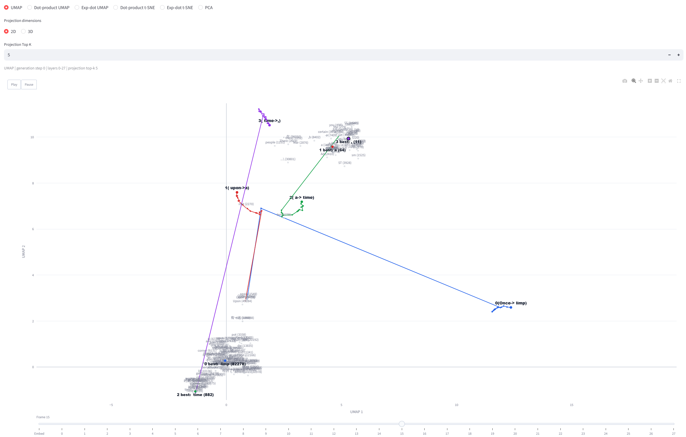

# LLM Miscellaneous Tools

[](https://streamlit.io)
[](https://pytorch.org)
[](https://plotly.com)

一套用于探查本地大语言模型权重、可视化模型内部机制以及评测工具调用数据集的综合工具。

> *[English version](README_en.md)*

---

## 模型可视化工具

基于 **Streamlit** 的交互式 Web 应用，用于探索、检查和调试 HuggingFace Transformer 模型。提供四个集成的可视化组件，覆盖从静态模型结构到动态推理追踪的完整流程。

### 系统架构

| 模块 | 职责 |
|------|------|
| **`model_runtime`** | 推理引擎 —— 加载模型、通过 PyTorch 前向 Hook 在自回归生成中捕获每层激活 |
| **`model_visualizer`** | Streamlit 前端 —— 消费推理数据，渲染 3D 结构图、注意力热力图、预测网格和嵌入轨迹动画 |

### 四个可视化组件

1. **模型结构 3D 可视化** —— 扫描 `config.json` 和 `.safetensors` 文件，按功能将权重矩阵分类（QKV 投影 / 注意力输出 / MLP 升维 / MLP 降维），以彩色 3D 立方体渲染，并用贝塞尔曲线标注数据流方向。

2. **逐步推理回放** —— 加载模型后支持单步推进自回归生成，用户可在每一步的每一层查看 Top-K 预测结果和多头注意力热力图。

3. **嵌入轨迹投影** —— 将所有层的隐藏状态投影到 2D/3D 空间，支持 PCA 和 UMAP 两种模式，可配置距离度量（余弦、点积、指数点积）。动画帧展示每个 token 的表示在层间的演变轨迹。

4. **静态演示导出** —— 将当前推理状态打包为可下载的 ZIP 文件（含 CSV、NPY 和独立 HTML 图表）。

### 快速开始

```powershell
# 将模型放置于 models/ 目录下（需包含 config.json 和 .safetensors）
python scripts/run_model_visualizer.py
```

若需使用嵌入轨迹投影的 PCA 模式，先预计算基底：

```powershell
python scripts/precompute_embedding_projection.py
```

### 效果展示

#### 1. 模型结构 —— 3D 权重矩阵布局

Qwen2.5-1.5B：每层分解为 Q/K/V（蓝）、注意力输出（绿）、MLP gate/up（橙/红）、MLP down（紫）四个功能阶段。



#### 2. 跨模型结构对比

Qwen2.5-1.5B vs Qwen3-0.6B vs Qwen2.5-7B vs Llama-3.1-8B —— 摘要表 + 3D 渲染。



#### 3. 参数分布直方图

六类核心矩阵的逐层归一化直方图，展示权重分布随层深的变化趋势。

| Qwen2.5-1.5B | Llama-3.1-8B |
|--------------|--------------|
|  |  |

Qwen2.5-7B `v_proj.weight` 单独视图 —— 浅层零附近峰值更高，深层分布略有展宽。



#### 4. 逐步推理 —— Top-K 预测

Qwen2.5-1.5B 处理 *"Once upon a time"* 时的第 15 层 —— 最后一个位置已将逗号预测为 Top-1，体现了中间层的早期收敛。



#### 5. 注意力热力图（第 15 层，12 个头）

多数头表现出"首 token 锚定"模式（关注 "Once"），个别头呈对角线自注意或混合上下文模式。



#### 6. 嵌入轨迹 —— PCA vs UMAP

PCA 将各 token 投影到较宽的带状区域，轨迹可见但缺乏清晰可分性。



点积 UMAP（第 15 层）—— 四条轨迹分散到独立区域，路径连续且落点与预测一致。



#### 7. 距离度量对比（第 15 层）

| 默认 UMAP（L2） | 指数点积 UMAP |
|-----------------|---------------|
|  |  |

点积 UMAP 在轨迹可分性、落点一致性和路径连续性三个维度上取得了最佳平衡。

### 核心发现

1. **参数分布差异**主要来自矩阵家族（Q/K/V 更尖窄，MLP 更平展），"浅层集中、深层相对分散"的趋势跨模型系列、跨矩阵类型一致存在。
2. **中间层解码**已能反映模型的决策方向 —— 在 *"Once upon a time"* 示例中，第 15 层最后位置已明显偏向标点补全。
3. **点积 UMAP** 在展示 token 级轨迹可分性和预测一致性方面优于 PCA、L2 和余弦距离。

---

## 评测工具

复制示例配置并填入本地路径或 API 凭据：

```powershell
Copy-Item configs/example.yaml configs/eval.yaml
python scripts/test_model.py --config configs/eval.yaml
```

`configs/eval.yaml`、`data/`、`models/`、`outputs/` 及日志文件均已被 Git 忽略。

---

## 测试

```powershell
pytest
```

标记为 `integration` 的测试需要外部 API 凭据或本地模型权重，缺少相应资源时会自动跳过。
